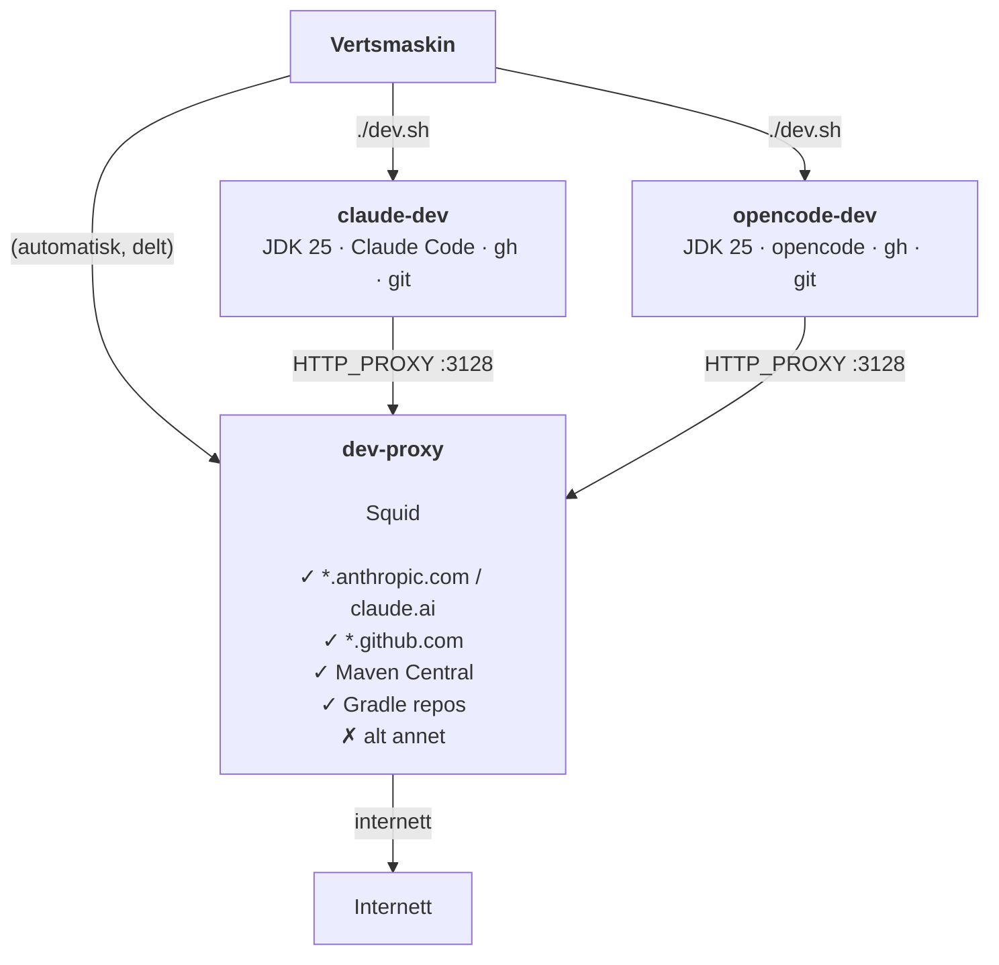

# Nedlåst utviklingscontainer (JDK og Gradle)

Portabelt og nedlåst utviklingsmiljø for agent-støttet Java-utvikling med Gradle. Ingen prosjektkode er bakt inn — imagene gjenbrukes på tvers av repoer.

*For GitHub bruk fingranulert token begrenset til de(t) aktuelle repo(s) og kun Content- og PR-tillatelser. Påse at god kodepraksis er fulgt for repo'et, og at det enten er eller kunne ha vært public.*

---

## Varianter

| Katalog | AI-verktøy | Container |
|---------|------------|-----------|
| `alpine25-gradle-claude/` | Claude Code CLI | `claude-dev` |
| `alpine25-gradle-opencode/` | opencode CLI | `opencode-dev` |

Se respektiv katalog for hurtigstart og verktøyspesifikke detaljer.

---

## Motivasjon

AI-agenter er kraftige verktøy: de kan lese og skrive filer, kjøre shell-kommandoer og utføre git-operasjoner autonomt. I et agentisk arbeidsflyt øker dette risikoen for utilsiktet datalekkasje, uønskede nettverkskall eller avhengigheter som hentes fra ukjente kilder.

Dette oppsettet begrenser agenten til et strengt kontrollert miljø:

- **Nettverkstilgang** er begrenset via en Squid-proxy — agenten kan jobbe med kode, kommunisere med API-et og laste ned avhengigheter fra Maven Central, men ikke nå ut til vilkårlige internett-ressurser.
- **Legitimasjon** lagres i Docker-volumer og eksponeres ikke utenfor container-miljøet.

Målet er å gi agenten akkurat nok tilgang til å være nyttig, og ikke mer.

---

## Arkitektur



Begge dev-containerne er kun koblet til det interne Docker-nettverket `proxy-net` — uten direkte internett-ruting. `dev-proxy` er en delt Squid-proxy som er bro mellom `proxy-net` og internett. Den slipper kun gjennom domener på whitelisten, filtrert på domenenavn (ikke IP-adresser), og fungerer derfor uavhengig av CDN-rotasjon.

---

## Nettverkswhitelist

Tillatte domener er definert i `shared/whitelist.conf`:

```
.anthropic.com
.claude.com
claude.ai
.github.com
.githubusercontent.com

# Maven Central
repo1.maven.org
repo.maven.apache.org

# Gradle
services.gradle.org
plugins.gradle.org
plugins-artifacts.gradle.org
downloads.gradle.org
```

### Legge til et nytt domene

Ingen rebuild og ingen container-restart nødvendig:

```sh
echo ".nyttdomene.com" >> shared/whitelist.conf
docker exec dev-proxy squid -k reconfigure
```

### Se hva som blokkeres

```sh
docker logs dev-proxy | grep DENIED
```

Eksempel på output:
```
TCP_DENIED/403 CONNECT example.com:443
```

---

## Persistens

Alle data som skal overleve en container-omstart lagres i Docker-volumer:

| Volum | Innhold |
|-------|---------|
| `repos` | Klonede repoer (`/repos`) |
| `gradle-cache` | Gradle-cache (`~/.gradle`) — holder daemonen varm |
| `gh-auth` | GitHub-legitimasjon (`~/.config/gh`) |

Verktøyspesifikke volumer (f.eks. `claude-auth`, `opencode-config`) er beskrevet i respektiv katalog.

---

## Miljøvariabler

Kopier `.env.example` til `.env` i prosjektkatalogen:

```sh
GIT_AUTHOR_NAME=Ditt Navn
GIT_AUTHOR_EMAIL=deg@eksempel.no

# Valgfritt: porter eksponert av dev-containeren (standardverdi: 8080, 8081)
GRADLE_PORT_1=8080
GRADLE_PORT_2=8081
```

### Portmapping

Dev-containerne eksponerer porter for applikasjoner som kjøres der:

| Variabel | Vertsport (standard) | Containerport |
|----------|----------------------|---------------|
| `GRADLE_PORT_1` | 8080 | 8080 |
| `GRADLE_PORT_2` | 8081 | 8081 |

En app som lytter på port 8080 inne i dev-containeren nås på `localhost:8080` fra verten.

Portmappinger settes ved container-opprettelse. Endre dem ved å stoppe containeren og kjøre `./dev.sh` på nytt:

```sh
docker rm -f <container-navn>
./dev.sh
```

---

## Verifisering

Kjør fra innsiden av dev-containeren:

| Sjekk | Kommando | Forventet |
|-------|----------|-----------|
| GitHub CLI | `gh --version` | Skriver ut versjon |
| Gradle-avhengigheter | `./gradlew dependencies` | Lastes ned via proxy |
| Nettverksrestriksjon | `curl -s --max-time 3 https://example.com` | Blokkert av proxy |
| GitHub nåbar | `curl -s https://api.github.com/zen` | Returnerer et sitat |
| Proxy-logger | `docker logs dev-proxy \| grep DENIED` | Viser blokkerte forsøk |

Verktøyspesifikke sjekker er beskrevet i respektiv katalog.
