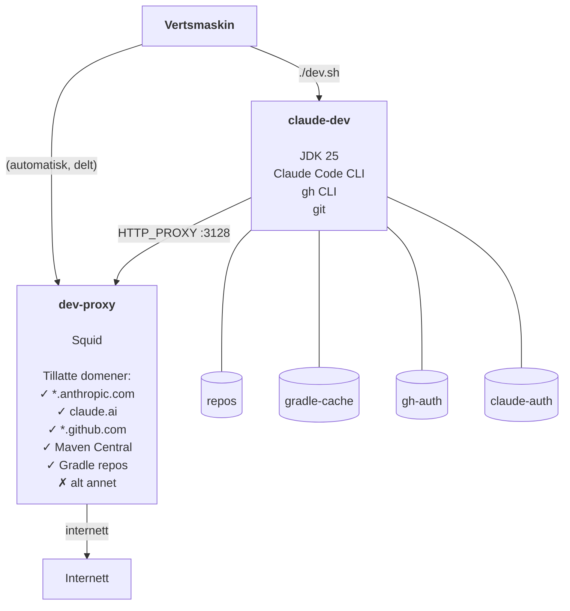

# Nedlåst utviklingscontainer for agent-støttet utvikling
**Med Java 25, Gradle, GitHub og Claude)**

> **Repo:** https://github.com/bekk/agentic-ai-tools

Portabel og nedlåst utviklingscontainer for Java 25, GitHub og Claude Code. Ingen prosjektkode er bakt inn — imaget gjenbrukes på tvers av repoer — med antakelsen om at Gradle brukes for bygging.

*Forutsetningen er at god kodepraksis er fulgt for repo'et, og at det enten er eller kunne ha vært public*

---

## Hurtigstart

Forutsetninger: Docker, `docker-compose`

```sh
# 1. [På vertsmaskin] Klon og gå inn i katalogen
git clone https://github.com/bekk/agentic-ai-tools.git
cd agentic-ai-tools/alpine25-gradle-claude

# 2. [På vertsmaskin] Sett git-identitet og eventuelt port-mapping
cp .env.example .env
# Rediger .env med navn, e-post og porter

# 3. [På vertsmaskin] Bygg imagene (én gang)
docker-compose -f ../shared/compose-proxy.yaml build
docker-compose build

# 4. [På vertsmaskin] Start dev-containeren (starter delt proxy automatisk)
./dev.sh

# 5. [I dev-container] Første gang: autentiser gh og Claude
gh auth login  # bruk fingranulert token begrenset til de(t) aktuelle repo(s) og kun Content- og PR-tillatelser
claude  # følg instruksjonene for å koble til API-nøkkel (nettleser kan ikke åpnes, så url må kopieres til nettleser og token limes tilbake)
gh repo clone <org>/<repo>
cd <repo>

# 6. [I dev-container] Start Claude
claude
```

```sh
# 7. [I dev-container] Få Claude til å bygge repo'et
(claude)> build it

# 8. [I dev-container] Start applikasjonen (port-mappingen må være konfigurert riktig)
./gradlew bootRun  # Hvis Spring Boot benyttes
```

---

## Motivasjon

Claude Code er et kraftig verktøy: det kan lese og skrive filer, kjøre shell-kommandoer og utføre git-operasjoner autonomt. I et agentisk arbeidsflyt øker dette risikoen for utilsiktet datalekkasje, uønskede nettverkskall eller avhengigheter som hentes fra ukjente kilder.

Dette oppsettet begrenser Claude til et strengt kontrollert miljø:

- **Nettverkstilgang** er begrenset via en Squid-proxy — Claude kan jobbe med kode, kommunisere med API-et og laste ned avhengigheter fra Maven Central, men ikke nå ut til vilkårlige internett-ressurser.
- **Legitimasjon** (GitHub, Claude) lagres i Docker-volumer og eksponeres ikke utenfor container-miljøet.

Målet er å gi Claude akkurat nok tilgang til å være nyttig, og ikke mer.

---

## Arkitektur



`claude-dev` er koblet kun til det interne nettverket `proxy-net`. `dev-proxy` er en delt proxy som brukes av alle dev-containere — den er bro mellom det interne nettverket og internett, og slipper kun gjennom domener på whitelisten.

---

## Nettverkswhitelist

Tillatte domener er definert i `../shared/whitelist.conf` (superset for alle dev-containere):

```
.anthropic.com
.claude.com
claude.ai
.github.com
.githubusercontent.com

# Maven Central
repo1.maven.org
repo.maven.apache.org

# Gradle
services.gradle.org
plugins.gradle.org
plugins-artifacts.gradle.org
downloads.gradle.org
```

### Legge til et nytt domene

Ingen rebuild og ingen container-restart nødvendig:

```sh
echo ".nyttdomene.com" >> ../shared/whitelist.conf
docker exec dev-proxy squid -k reconfigure
```

### Se hva som blokkeres

```sh
docker logs dev-proxy | grep DENIED
```

---

## Persistens

Alle data som skal overleve en container-omstart lagres i Docker-volumer:

| Volum | Montert i | Innhold |
|-------|-----------|---------|
| `repos` | claude-dev | Klonede repoer (`/repos`) |
| `gradle-cache` | claude-dev | Gradle-cache (`~/.gradle`) — holder daemonen varm |
| `gh-auth` | claude-dev | GitHub-legitimasjon (`~/.config/gh`) |
| `claude-auth` | claude-dev | Claude-legitimasjon (`~/.claude`) |

`gh` og Claude trenger bare autentiseres én gang — legitimasjonen bevares mellom omstarter.

---

## Miljøvariabler

Kopier `.env.example` til `.env` ved siden av `compose.yaml`:

```sh
GIT_AUTHOR_NAME=Ditt Navn
GIT_AUTHOR_EMAIL=deg@eksempel.no

# Valgfritt: porter eksponert av claude-dev (standardverdi: 8080, 8081)
GRADLE_PORT_1=8080
GRADLE_PORT_2=8081
```

`.env` er valgfritt — standardverdiene brukes hvis filen mangler.

### Portmapping

`claude-dev` eksponerer porter for applikasjoner som kjøres der:

| Variabel | Vertsport (standard) | Containerport |
|----------|----------------------|---------------|
| `GRADLE_PORT_1` | 8080 | 8080 |
| `GRADLE_PORT_2` | 8081 | 8081 |

En app som lytter på port 8080 inne i dev-containeren nås på `localhost:8080` fra verten.

Portmappinger settes ved container-opprettelse. Hvis du endrer porter etter at `claude-dev` allerede kjører, må du fjerne den først:

```sh
docker rm -f claude-dev
./dev.sh
```

---

## Verifisering av Dev-containeren

| Sjekk | Kommando | Forventet |
|-------|----------|-----------|
| Claude Code | `claude --version` | Skriver ut versjon |
| GitHub CLI | `gh --version` | Skriver ut versjon |
| Gradle-avhengigheter | `./gradlew dependencies` | Lastes ned via proxy |
| Nettverksrestriksjon | `curl -s --max-time 3 https://example.com` | Blokkert av proxy |
| GitHub nåbar | `curl -s https://api.github.com/zen` | Returnerer et sitat |
| Anthropic nåbar | API-kall via `claude` | Fungerer |
| Proxy-logger | `docker logs dev-proxy \| grep DENIED` | Viser blokkerte forsøk |
