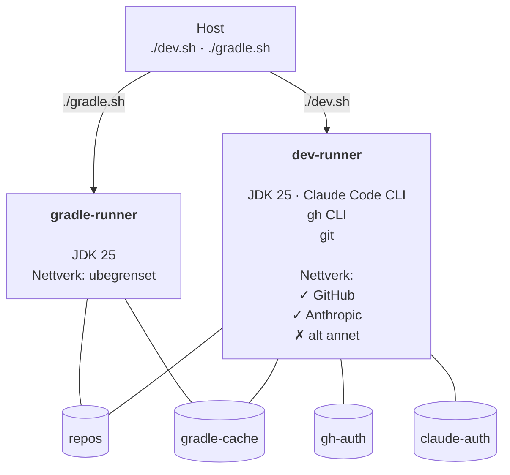

# alpine25-gradle-claude

> **Repo:** https://github.com/bekk/agentic-ai-tools

Portabel og nedlåst utviklingscontainer for Kotlin/JVM/Gradle-prosjekter med Claude Code. Ingen prosjektkode er bakt inn — imaget gjenbrukes på tvers av repoer.

---

## Hurtigstart

Forutsetninger: Docker, `docker-compose`

```sh
# 1. Klon og gå inn i katalogen
git clone https://github.com/bekk/agentic-ai-tools.git
cd agentic-ai-tools/alpine25-gradle-claude

# 2. Sett git-identitet
cp .env.example .env
# Rediger .env med navn og e-post

# 3. Bygg imaget (én gang)
docker-compose build

# 4. Start dev-containeren
./dev.sh

# 5. Første gang: autentiser gh og Claude
gh auth login
claude  # følg instruksjonene for å koble til API-nøkkel

# 6. Klon ditt repo og start Claude
gh repo clone <org>/<repo>
cd <repo>
claude
```

For Gradle-bygg, kjør fra **vertsmaskinen** (ikke inne i dev-containeren):

```sh
./gradle.sh "cd <repo> && ./gradlew build"
```

Når ingen nye avhengigheter trenger å lastes ned, fungerer `./gradlew` fint direkte inne i dev-containeren via den delte gradle-cachen. Bruk `gradle.sh` (gradle-runner) når avhengigheter endres, siden dev-runner har begrenset nettverkstilgang.

```sh
# 7. Få Claude til å bygge repo'et (når avhengigheter ikke endres, eller bruk gradle-containeren)
(claude)> build it
```

---

## Motivasjon

Claude Code er et kraftig verktøy: det kan lese og skrive filer, kjøre shell-kommandoer og utføre git-operasjoner autonomt. I et agentisk arbeidsflyt øker dette risikoen for utilsiktet datalekkasje, uønskede nettverkskall eller avhengigheter som hentes fra ukjente kilder.

Dette oppsettet begrenser Claude til et strengt kontrollert miljø:

- **Nettverkstilgang** er begrenset til GitHub og Anthropic — Claude kan jobbe med kode og kommunisere med API-et sitt, men ikke nå ut til vilkårlige internett-ressurser.
- **Gradle-bygg** kjøres i en separat container uten nettverksbegrensning, siden nedlasting av avhengigheter fra Maven Central og lignende er nødvendig og forventet.
- **Legitimasjon** (GitHub, Claude) lagres i Docker-volumer og eksponeres ikke utenfor container-miljøet.

Målet er å gi Claude akkurat nok tilgang til å være nyttig, og ikke mer.

---

## Arkitektur



Nettverksbegrensningen i `dev-runner` settes opp ved oppstart via iptables: GitHubs publiserte IP-blokker hentes fra `api.github.com/meta`, Anthropics endepunkter løses via DNS, deretter blokkeres all annen utgående trafikk.

---

## Persistens

Alle data som skal overleve en container-omstart lagres i Docker-volumer:

| Volum | Montert i | Innhold |
|-------|-----------|---------|
| `repos` | begge | Klonede repoer (`/repos`) |
| `gradle-cache` | begge | Gradle-cache (`~/.gradle`) — holder daemonen varm |
| `gh-auth` | dev-runner | GitHub-legitimasjon (`~/.config/gh`) |
| `claude-auth` | dev-runner | Claude-legitimasjon (`~/.claude`) |

`gh` og Claude trenger bare autentiseres én gang — legitimasjonen bevares mellom omstarter.

---

## Miljøvariabler

Kopier `.env.example` til `.env` ved siden av `compose.yaml`:

```sh
GIT_AUTHOR_NAME=Ditt Navn
GIT_AUTHOR_EMAIL=deg@eksempel.no
```

---

## Verifisering av Dev-containeren

| Sjekk | Kommando | Forventet |
|-------|----------|-----------|
| Claude Code | `claude --version` | Skriver ut versjon |
| GitHub CLI | `gh --version` | Skriver ut versjon |
| Nettverksrestriksjon | `curl -s --max-time 3 https://example.com` | Timeout |
| GitHub nåbar | `curl -s https://api.github.com/zen` | Returnerer et sitat |
| Anthropic nåbar | API-kall via `claude` | Fungerer |
