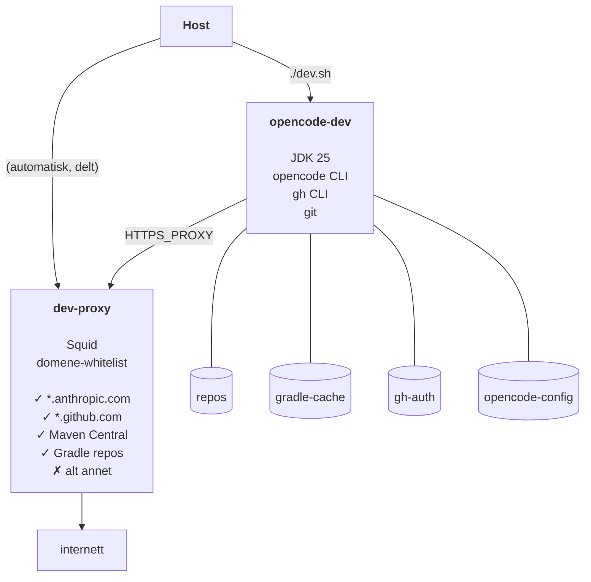

# Nedlåst utviklingscontainer for agent-støttet utvikling
**Med Java 25, Gradle, GitHub og opencode**

> **Repo:** https://github.com/bekk/agentic-ai-tools

Portabel og nedlåst utviklingscontainer for Java 25, GitHub og opencode. Ingen prosjektkode er bakt inn — imaget gjenbrukes på tvers av repoer — med antakelsen om at Gradle brukes for bygging.

---

## Hurtigstart

Forutsetninger: Docker, `docker-compose`

```sh
# 1. Klon og gå inn i katalogen
git clone https://github.com/bekk/agentic-ai-tools.git
cd agentic-ai-tools/alpine25-gradle-opencode

# 2. Sett git-identitet og API-nøkkel
cp .env.example .env
# Rediger .env med navn, e-post og ANTHROPIC_API_KEY

# 3. Bygg imagene (én gang)
docker-compose -f ../shared/compose-proxy.yaml build
docker-compose build

# 4. Start dev-containeren (starter delt proxy automatisk)
./dev.sh

# 5. Første gang: autentiser gh
gh auth login  # bruk fingranulert token begrenset til de(t) aktuelle repo(s) og kun Content- og PR-tillatelser

# 6. Klon ditt repo og start opencode
gh repo clone <org>/<repo>
cd <repo>
opencode
```

```sh
# 7. [I dev-containeren] Få opencode til å bygge repo'et
(opencode)> build it

# 8. [I dev-containeren] Start applikasjonen (port-mappingen må være konfigurert riktig)
(opencode)> /exit
./gradlew bootRun  # Hvis Spring Boot benyttes
```

---

## Motivasjon

Opencode er et kraftig verktøy: det kan lese og skrive filer, kjøre shell-kommandoer og utføre git-operasjoner autonomt. I et agentisk arbeidsflyt øker dette risikoen for utilsiktet datalekkasje, uønskede nettverkskall eller avhengigheter som hentes fra ukjente kilder.

Dette oppsettet begrenser opencode til et strengt kontrollert miljø:

- **Nettverkstilgang** er begrenset via en Squid-proxy — opencode kan jobbe med kode, kommunisere med API-et og laste ned avhengigheter fra Maven Central, men ikke nå ut til vilkårlige internett-ressurser.
- **Legitimasjon** (GitHub-token, Anthropic API-nøkkel) lagres i Docker-volumer og miljøvariabler, og eksponeres ikke utenfor container-miljøet.

Målet er å gi opencode akkurat nok tilgang til å være nyttig, og ikke mer.

---

## Arkitektur



Nettverksisolasjon oppnås via Docker-nettverk: `opencode-dev` er kun koblet til det interne nettverket `proxy-net` uten direkte internett-ruting. All utgående trafikk går gjennom den delte `dev-proxy` (Squid), som tillater kun domener listet i `shared/whitelist.conf`. Filtrering skjer på domenenavn — ikke IP-adresser — og fungerer derfor uavhengig av CDN-rotasjon.

---

## Persistens

Alle data som skal overleve en container-omstart lagres i Docker-volumer:

| Volum | Montert i | Innhold |
|-------|-----------|---------|
| `repos` | opencode-dev | Klonede repoer (`/repos`) |
| `gradle-cache` | opencode-dev | Gradle-cache (`~/.gradle`) — holder daemonen varm |
| `gh-auth` | opencode-dev | GitHub-legitimasjon (`~/.config/gh`) |
| `opencode-config` | opencode-dev | Opencode-konfig (`~/.config/opencode`) |

`gh` trenger bare autentiseres én gang — legitimasjonen bevares mellom omstarter. Anthropic-tilgang skjer via `ANTHROPIC_API_KEY` i `.env`.

---

## Nettverkswhitelist

Tillatte domener er definert i `../shared/whitelist.conf` (superset for alle dev-containere):

```
.anthropic.com
.github.com
.githubusercontent.com

# Maven Central
repo1.maven.org
repo.maven.apache.org

# Gradle
services.gradle.org
plugins.gradle.org
plugins-artifacts.gradle.org
downloads.gradle.org
```

### Legge til et nytt domene

Ingen rebuild og ingen container-restart nødvendig:

```sh
echo ".nyttdomene.com" >> ../shared/whitelist.conf
docker exec dev-proxy squid -k reconfigure
```

### Se hva som blokkeres

```sh
docker logs dev-proxy | grep DENIED
```

Eksempel på output:
```
TCP_DENIED/403 CONNECT example.com:443
```

---

## Miljøvariabler

Kopier `.env.example` til `.env` ved siden av `compose.yaml`:

```sh
GIT_AUTHOR_NAME=Ditt Navn
GIT_AUTHOR_EMAIL=deg@eksempel.no

# Påkrevd: Anthropic API-nøkkel for opencode
ANTHROPIC_API_KEY=sk-ant-...

# Valgfritt: porter eksponert av opencode-dev (standardverdi: 8080, 8081)
GRADLE_PORT_1=8080
GRADLE_PORT_2=8081
```

`ANTHROPIC_API_KEY` er påkrevd for at opencode skal fungere. De øvrige variablene har standardverdier.

### Portmapping

`opencode-dev` eksponerer porter for applikasjoner som kjøres der:

| Variabel | Vertsport (standard) | Containerport |
|----------|----------------------|---------------|
| `GRADLE_PORT_1` | 8080 | 8080 |
| `GRADLE_PORT_2` | 8081 | 8081 |

En app som lytter på port 8080 inne i dev-containeren nås på `localhost:8080` fra verten.

Portmappinger settes ved container-opprettelse. Hvis du endrer porter etter at `opencode-dev` allerede kjører, må du fjerne den først:

```sh
docker rm -f opencode-dev
./dev.sh
```

---

## Verifisering av Dev-containeren

| Sjekk | Kommando | Forventet |
|-------|----------|-----------|
| Opencode CLI | `opencode --version` | Skriver ut versjon |
| GitHub CLI | `gh --version` | Skriver ut versjon |
| Gradle-avhengigheter | `./gradlew dependencies` | Lastes ned via proxy |
| Nettverksrestriksjon | `curl -s --max-time 3 https://example.com` | Feil (blokkert av proxy) |
| GitHub nåbar | `curl -s https://api.github.com/zen` | Returnerer et sitat |
| Anthropic nåbar | API-kall via `opencode` | Fungerer |
| Proxy-logg | `docker logs dev-proxy \| grep DENIED` | Viser blokkerte forsøk |
