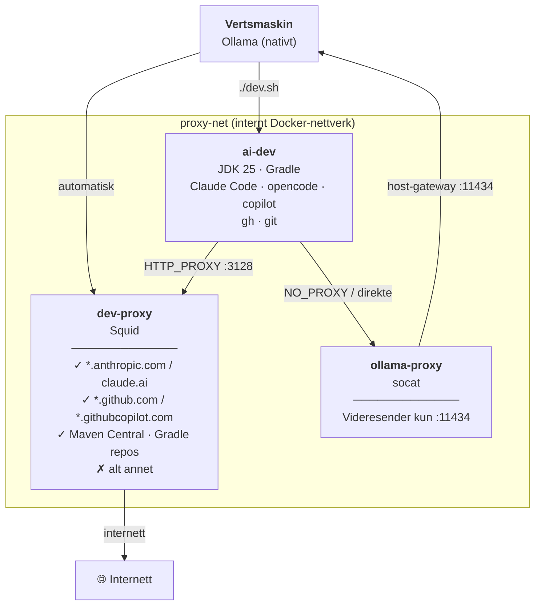

# Nedlåst AI-utviklingsmiljø for Java

> Et portabelt, nettverksisolert utviklingscontainer med AI-agenter innebygd — klar til bruk på tvers av repoer.

---

## Motivasjon

AI-agenter er kraftige verktøy — og kraftige verktøy trenger grenser.

En kodingsagent kan lese og skrive filer, kjøre shell-kommandoer og utføre git-operasjoner helt autonomt. Det åpner for utilsiktede hendelser:

- **Datalekkasje** — agenten sender kildekode til ukjente tjenester
- **Ukontrollerte avhengigheter** — tredjepartskode hentes fra vilkårlige kilder
- **Uønskede handlinger** — push til feil branch, API-kall til ukjente endepunkt

**Målet:** gi agenten akkurat nok tilgang til å være nyttig — og ikke mer.

> *For GitHub: bruk fingranulert token begrenset til aktuelle repo(s) med kun Content- og PR-tillatelser. Påse at god kodepraksis er fulgt, og at kodebasen er eller kunne ha vært public.*

---

## Arkitektur



**Tre containere, to nettverk:**

| Container | Rolle | Nettverkstilgang |
|-----------|-------|-----------------|
| `ai-dev` | Utviklingsmiljø | Kun `proxy-net` (internt) |
| `dev-proxy` | Squid-proxy | `proxy-net` + `external-net` (internett) |
| `ollama-proxy` | Port-forward til Ollama på verten | Kun `proxy-net` + `host-gateway` |

All trafikk fra `ai-dev` tvinges gjennom proxyen — Node.js (`undici`), Java (`GRADLE_OPTS`), og curl/wget via `HTTP_PROXY`/`HTTPS_PROXY`. Unntak: `ollama-proxy` er listet i `NO_PROXY` og nås direkte container-til-container. `ollama-proxy` videresender kun port 11434 til verten — ingen annen tilgang til lokale tjenester er mulig.

**Persistens i Docker-volumer:**

| Volum | Innhold |
|-------|---------|
| `repos` | Klonede repoer |
| `gradle-cache` | Gradle-cache — holder daemonen varm mellom sesjoner |
| `gh-auth` | GitHub-legitimasjon |
| `claude-auth` | Claude Code-legitimasjon |
| `opencode-config` | opencode-konfigurasjon |

---

## Kom i gang — steg for steg

**Forutsetninger:** Docker, `docker-compose` (og f.eks. Colima på Mac)

```sh
# 0. [Vertsmaskin] Gi nok minne til container-tjenesten
colima start --memory 8
```

```sh
# 1. [Vertsmaskin] Klon repoet
git clone https://github.com/bekk/agentic-ai-tools.git
cd agentic-ai-tools/dev-sandbox/jdk-gradle

# 2. [Vertsmaskin] Sett identitet og API-nøkkel
cp .env.example .env
# Rediger .env — fyll inn navn, e-post og ANTHROPIC_API_KEY

# 3. [Vertsmaskin] Bygg imagene (kun første gang)
docker-compose build

# 4. [Vertsmaskin] Start containerne
./dev.sh
```

```sh
# 5. [ai-dev] Første gang: autentiser GitHub
gh auth login
#    → bruk fingranulert token med kun Content- og PR-tillatelser

# 6. [ai-dev] Klon ditt prosjektrepo
gh repo clone <org>/<repo>
cd <repo>

# 7. [ai-dev] Start en AI-agent og sett den i gang
claude        # Følg eventuell autentiseringsflyt første gang
(ai)> bygg prosjektet og fiks eventuelle kompileringsfeil

# — eller med opencode —
opencode      # Krever miljøvariabel for claude sin api-nøkkel 
(ai)> bygg prosjektet og fiks eventuelle kompileringsfeil

# — eller med GitHub Copilot CLI —
copilot       # Allerede logget på med gh auth login
(ai)> bygg prosjektet og fiks eventuelle kompileringsfeil

# 8. [Vertsmaskin] Åpne et nytt shell mot samme container
./shell.sh
./gradlew bootRun    # hvis Spring Boot
```

**Autentiseringstips:**
- **Claude Code:** `BROWSER=/bin/echo` gjør at URL skrives til terminalen — kopier og åpne i nettleseren på verten
- **opencode:** bruker `ANTHROPIC_API_KEY` fra `.env` — ingen manuell login
- **copilot:** bruker GitHub-legitimasjonen fra `gh auth login` — ingen ekstra steg

---

## Ollama — lokale LLM-modeller

Ollama kjører nativt på vertsmaskinen for å utnytte maskinvaren fullt ut (f.eks. Apple Silicon GPU). Sandkassen når Ollama via `ollama-proxy` — en socat-container som utelukkende videresender port 11434 til verten. Ingen andre lokale tjenester er tilgjengelige fra sandkassen.

### Installere og starte Ollama

```sh
# [Vertsmaskin] Installer Ollama
brew install ollama

# [Vertsmaskin] Start Ollama
ollama serve
```

### Laste ned en modell

```sh
# [Vertsmaskin] Last ned en modell
ollama pull qwen3-coder-next

# Andre eksempler
ollama pull qwen3-coder     # 19 GB
ollama pull llama3.3        # 43 GB
```

> Modeller kan være mange titalls GB og lagres lokalt på vertsmaskinen.

### Bruke Ollama fra ai-dev

opencode registrerer tilgjengelige modeller automatisk ved oppstart av `ai-dev`. Start sandkassen etter at Ollama kjører:

```sh
# [ai-dev] Bruk opencode med en lokal modell
opencode --model ollama/qwen3-coder-next

# [ai-dev] List tilgjengelige modeller
curl http://ollama-proxy:11434/api/tags

# [ai-dev] Kall API-et direkte
curl http://ollama-proxy:11434/api/generate -d '{
  "model": "qwen3-coder-next",
  "prompt": "Forklar denne Java-koden",
  "stream": false
}'
```

> Nye modeller lastet ned etter at `ai-dev` startet krever en omstart av sandkassen (`./dev.sh`) for å bli registrert i opencode.

### Verifisering

```sh
# [Vertsmaskin] Sjekk at Ollama kjører
ollama list

# [ai-dev] Bekreft at modellen er tilgjengelig via proxy
curl -s http://ollama-proxy:11434/api/tags | jq '.models[].name'
```

---

## Fordeler og ulemper

### Fordeler

| | |
|---|---|
| **Nettverksisolasjon** | Agenten kan ikke nå vilkårlige internett-ressurser. Whitelisten er eksplisitt og enkel å revidere. |
| **Ingen kode bakt inn** | Imaget er generisk — det samme imaget gjenbrukes på tvers av alle Java/Gradle-repoer. |
| **Legitimasjon i volumer** | Tokens og nøkler lever utenfor kildekoden og overlever container-omstart. |
| **Tre AI-verktøy i ett** | Claude Code (agentic), opencode (alternativ UI), copilot (CLI-spørsmål og forklaringer). |
| **Lokale modeller** | Ollama kjører nativt på verten med full GPU-tilgang. Sandkassen når kun port 11434 via `ollama-proxy` — ingen annen tilgang til lokale tjenester. |
| **Live whitelist-endring** | Nytt domene kan legges til uten rebuild eller container-restart. |
| **Reproduserbart** | Alle avhengigheter er pinnet i Dockerfile — samme image på alle maskiner. |

### Ulemper

| | |
|---|---|
| **Bygg tar tid** | `docker-compose build` laster ned JDK, Node.js, tre AI-verktøy — plan for 5–10 min ved første bygg. |
| **Minnekrav** | Colima bør ha minst 8 GB for å kjøre JVM + AI-prosesser komfortabelt. |
| **Whitelist-vedlikehold** | Nye tjenester (f.eks. private artifact-registre) krever manuell tillegg i `whitelist.conf`. |
| **Ingen GUI** | Rent CLI-miljø — IDE-integrasjoner (VS Code Remote, IntelliJ Gateway) krever ekstra oppsett. |
| **Statisk proxy-konfig** | Squid-proxyen er enkel — ingen autentisering, rate limiting eller detaljert logging per agent. |

---

## Veien videre

**Nærmeste tiltak:**

- [ ] Private artifact-registre (Nexus, Artifactory) — legg til domener i whitelist og evt. credentials i volum
- [ ] IDE-integrasjon — VS Code Remote Containers eller IntelliJ Gateway mot `ai-dev`
- [ ] Flere språk/byggverktøy — variant med Maven, Node.js-prosjekter, Python

**Mer ambisiøst:**

- [ ] Egendefinert proxy-policy per agent (f.eks. strengere regler for autonome kjøringer)
- [ ] Auditlogg — strukturert logging av alle agenthandlinger (fil, git, nett)
- [ ] CI-integrasjon — kjør agenten i en engangskontainer som del av PR-prosessen
- [ ] Secrets-håndtering — integrasjon med Vault eller cloud-native secrets manager i stedet for `.env`

---

## Rask verifisering

```sh
# Kjør inne i ai-dev etter oppstart:
claude --version       # Claude Code installert
opencode --version     # opencode installert
copilot --version      # GitHub Copilot CLI installert
gh --version           # GitHub CLI installert

curl -s --max-time 3 https://example.com          # → blokkert av proxy
curl -s https://api.github.com/zen                # → returnerer et sitat

docker logs dev-proxy | grep DENIED               # → viser blokkerte forsøk

# Ollama (hvis Ollama kjører nativt på verten):
curl -s http://ollama-proxy:11434/api/tags        # → liste over nedlastede modeller
```
